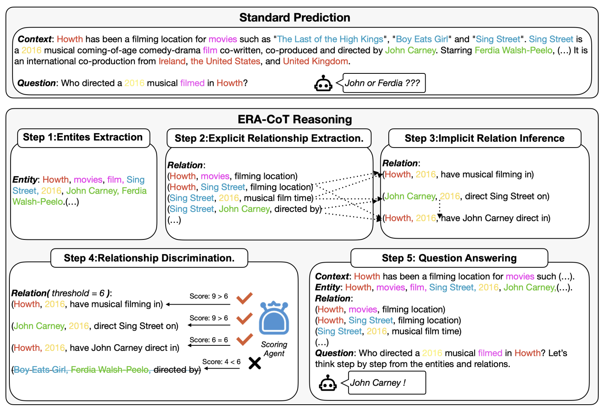
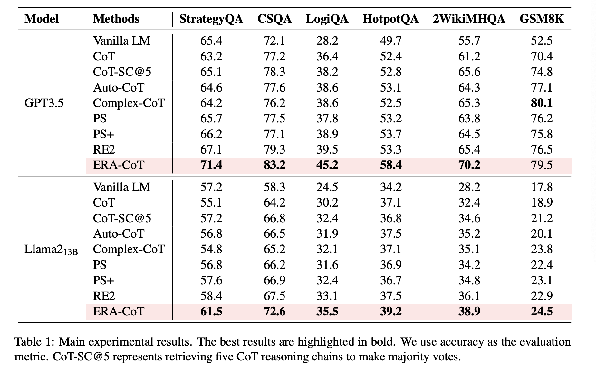

# ERA-CoT: Improving Chain-of-Thought through Entity Relationship Analysis

<p align="center">
</a>


</p>

This is the codebase of the paper: [ERA-CoT: Improving Chain-of-Thought through Entity Relationship Analysis](https://arxiv.org/abs/2403.06932).




🔥 We are releasing the version 1.0 for running on Llama2 model.

## How to Use

Update your environment for the required dependency. 

```shell
pip install -r requirement.txt
```

Get your Llama2 weight on https://huggingface.co/meta-llama/Llama-2-7b-chat-hf/tree/main, set up on default directory: /root/llama-2-7b-chat-hf (You can change the dir on era-cot/config.py)

Running the code:

```shell
python main.py --dataset gsm8k \
--engine llama2-7b \
--temperature 0.3
```

## Set up for your dataset

* Upload your json version of dataset on era-cot/dataset.

* Setting for loading your dataset on utils.

### Example

```shell
if args.dataset.lower() == 'commonsenseqa':
      json_res = decoder.raw_decode(line)[0]
      choice = "Answer Choices:"
      for c in json_res["question"]["choices"]:
            choice += " ("
            choice += c["label"]
            choice += ") "
            choice += c["text"]
            q = json_res["question"]["stem"].strip() + " " + choice
            a = json_res["answerKey"]
            id = 'temp_{}'.format(idx)
      questions.append(q)
      answers.append(a)
      ids.append(id)
```

## Different Dataset Results

✨ERA-CoT

* Entity extraction on text and finds out all the explicit relationships mentioned in the text.
* Gradually infers the possible implicit relationships involved between entities based on the explicit relationships.
* Scores and filters the reliability of these implicit relationships.
* Finally answers questions based on these entity relationships. 



## Citation

If you ERA-CoT help your work, please cite:

```bibtex 
@misc{liu2024eracot,
      title={ERA-CoT: Improving Chain-of-Thought through Entity Relationship Analysis}, 
      author={Yanming Liu and Xinyue Peng and Tianyu Du and Jianwei Yin and Weihao Liu and Xuhong Zhang},
      year={2024},
      eprint={2403.06932},
      archivePrefix={arXiv},
      primaryClass={cs.CL}
}

```

## License
For academic and non-commercial use only.The whole project is under the CC-BY-NC 4.0 license. See [LICENSE](https://creativecommons.org/licenses/by-nc-sa/4.0/) for additional details.
